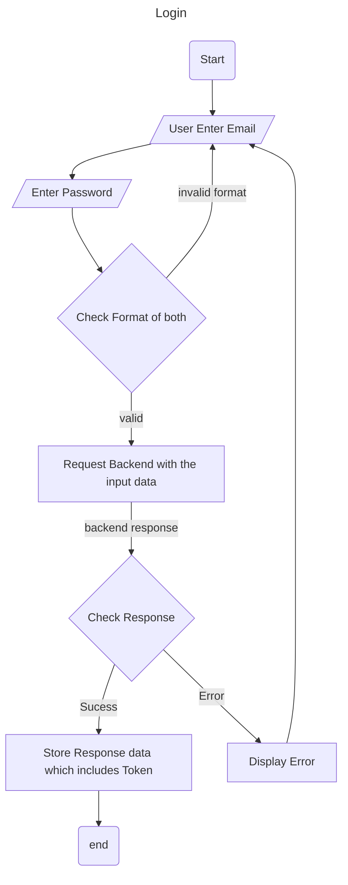
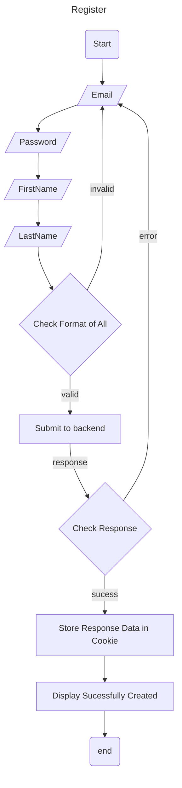
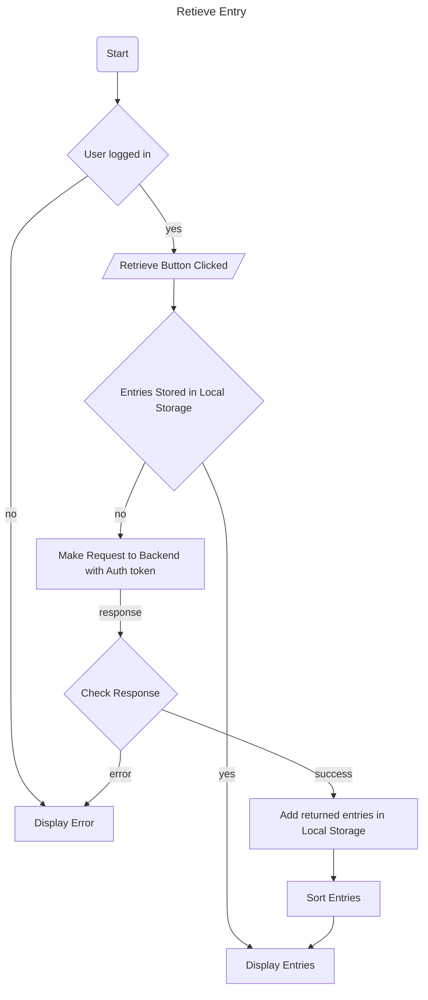

# Journal App

This is a React website that serves as a frontend for the Journal App API.

```mermaid
---
title: Login
---


flowchart TD
   A(Start) --> B[/User Enter Email/] --> C[/Enter Password/] --> D{Check Format of both}
   D -- invalid format--> B
   D -- valid --> E[Request Backend with the input data] -- backend response --> F{Check Response}
   F -- Sucess --> G[Store Response data which includes Token] --> I(end)
   F -- Error --> H[Display Error] --> B
```

Register

```mermaid
---
title: Register
---

flowchart TD
  A(Start) --> B1[/Email/] --> B2[/Password/] --> B3[/FirstName/] --> B4[/LastName/] --> D{Check Format of All}
  D -- invalid --> B1
  D -- valid --> E[Submit to backend] -- response --> F{Check Response} -- error --> B1
  F -- sucess --> I[Store Response Data in Cookie] --> G[Display Sucessfully Created]--> H(end)

```

Retrieve

```mermaid
---
title: Retieve Entry
---


flowchart TD
   A(Start) --> A1{User logged in}-- yes --> B1[/Retrieve Button Clicked/] --> C{Entries Stored in Local Storage} -- yes --> D[Display Entries]
   A1 -- no --> A2[Display Error]
   C -- no --> E[Make Request to Backend with Auth token] -- response --> F{Check Response} -- error --> A2
   F -- success --> G[Add returned entries in Local Storage] --> H[Sort Entries] --> D


```
